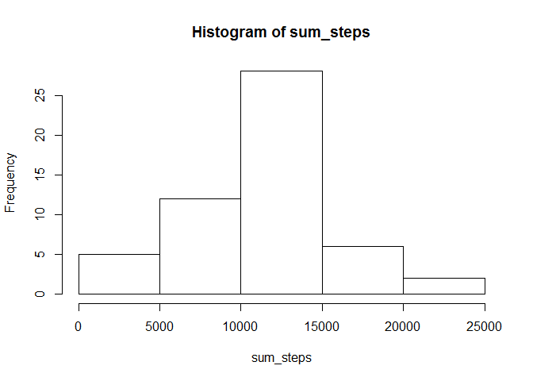
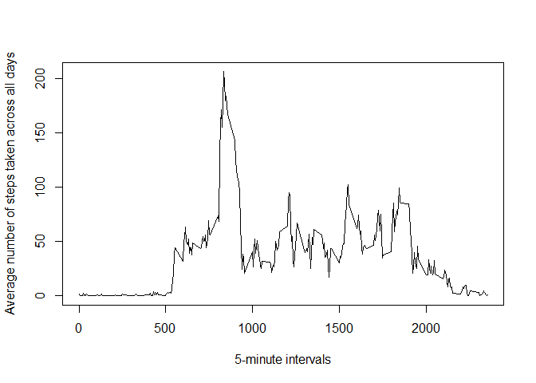
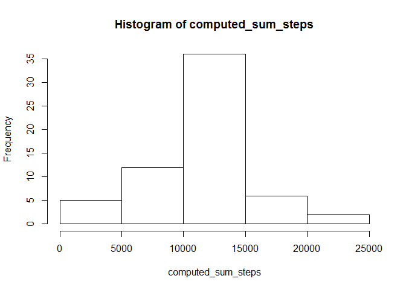

----------------------
title: "Reproducible Research: Peer Assessment 1"
author: "Casal9712"
date: "June 14, 2015"
output: html_document
----------------------

Programming assignment 1 for Reproducible Research

Here are the packages needed for the following programmings: plyr

Loading and preprocessing the data
---
first download the activity.zip, unzip the file and place the activity.csv into the working directory, more processing of data are in the sebsequent programs.

```r
library(plyr)
setwd("C:\\Users\\m i n g\\Desktop\\Data Science Signature Track\\Reproducible Research\\Week 2")
data<-read.csv("activity.csv")
```

What is mean total number of steps taken per day?
---
Subset data to create one without missing

```r
data1<-data[complete.cases(data),]
```

Calculate the total number of steps taken per day

```r
sum_steps<-tapply(data1$steps,data1$date,sum,na.rm=TRUE)
```

Make a histogram of the total number of steps taken each day

```r
hist(sum_steps)
```

 

Calculate and report the mean and median of the total number of steps taken per day through summary functions.
As seen below, mean is 10770, median is 10760.

```r
summary(sum_steps)
```

```
##    Min. 1st Qu.  Median    Mean 3rd Qu.    Max.    NA's 
##      41    8841   10760   10770   13290   21190       8
```

What is the average daily activity pattern?
---
Make a time series plot of the 5-minute interval (x-axis) and the average number of
steps taken, averaged across all days (y-axis)

- first calculate mean steps across days for each interval and convert it to data.frame

```r
avg_steps<-tapply(data$steps,data$interval,mean,na.rm=TRUE)
avg_steps1<-as.data.frame(avg_steps)
```

- Get a list of unique interval values and combind with the data.frame with mean steps values

```r
int<-unique(data$interval)
pattern<-cbind(int,avg_steps1)
```

- plot mean steps against 5-min interval

```r
plot(pattern$int,pattern$avg_steps,type="l",
		ylab="Average number of steps taken across all days",
		xlab="5-minute intervals")
```

 

Which 5-minute interval, on average across all the days in the dataset, contains the maximum number of steps?

Ans: 8:35 has the maximum number of steps with 104 steps

```r
which(pattern$avg_steps==max(pattern$avg_steps))
```

```
## 835 
## 104
```

Imputing missing values
---
Calculate and report the total number of missing values in the dataset
There are 2304 missing values.

```r
sum(!complete.cases(data))
```

```
## [1] 2304
```

Devise a strategy for filling in all of the missing values in the dataset.
The mean of a specific 5-min interval across all days will be used to fill in NAs.

- First merge the data and the pattern data earlier

```r
fill_na<-merge(data,pattern,by.x="interval",by.y="int",all.x=TRUE)
```

- Then use a generic function for imputing missing values with specific function,
in this case, use mean() when calling this function in the next step.

```r
impute <- function(x, fun) {
    missing <- is.na(x)
		replace(x, missing, fun(x[!missing]))
}
```

- Finally create a new dataset that is equal to the original dataset but with the missing data filled in.

```r
computed_data<-ddply(data, ~ interval, transform, steps = impute(steps, mean))
```

- Calculate the total number of steps taken per day

```r
computed_sum_steps<-tapply(computed_data$steps,computed_data$date,sum,na.rm=TRUE)
```

Make a histogram of the total number of steps taken each day

```r
hist(computed_sum_steps)
```

 

Calculate and report the mean and median of the total number of steps taken per day using summary function. As seen below, mean is 10770, median is 10770.

```r
summary(computed_sum_steps)
```

```
##    Min. 1st Qu.  Median    Mean 3rd Qu.    Max. 
##      41    9819   10770   10770   12810   21190
```
Do these values differ from the estimates from the first part of the assignment?
Ans: When compare to estimates from part 1, both mean stayed the same and median is minimally off by 10.

What is the impact of imputing missing data on the estimates of the total daily number of steps?
Overall the imputation did not affect the estimates much, but the total daily number of steps increased.

Are there differences in activity patterns between weekdays and weekends?
---
Create a new factor variable in the dataset with two levels - "weekday" and "weekend"
indicating whether a given date is a weekday or weekend day.

- first convert date values from factor to POSIXlt

```r
computed_data$date<-strptime(computed_data$date, "%Y-%m-%d")
```

- then recode data into weekday or weekend

```r
computed_data$wkday_wkend <- as.factor(ifelse(weekdays(computed_data$date) %in% 
    c("Saturday","Sunday"),"weekend", "weekday"))
```

Make a panel plot containing a time series plot of the 5-minute interval(x-axis)
and the average number of steps taken, averaged across all weekday days or weekend days(y-axis).

- first subset the filled in data into one with only weekday data and another with only weekend data

```r
weekend<-computed_data[computed_data$wkday_wkend=="weekend",]
weekday<-computed_data[computed_data$wkday_wkend=="weekday",]
```

- then Create data for plotting for weekend and for weekday

```r
	avg_steps_wke<-tapply(weekend$steps,weekend$interval,mean,na.rm=TRUE)
	avg_steps_wke1<-as.data.frame(avg_steps_wke)
	
	# int was already created earlier, no need to create again
	pattern_wke<-cbind(int,avg_steps_wke1)
	pattern_wke$wkday_wkend<-"weekend"
	colnames(pattern_wke)[2]<-"avg_steps"
	
	avg_steps_wkd<-tapply(weekday$steps,weekday$interval,mean,na.rm=TRUE)
	avg_steps_wkd1<-as.data.frame(avg_steps_wkd)
	
	# int was already created earlier, no need to create again
	pattern_wkd<-cbind(int,avg_steps_wkd1)
	pattern_wkd$wkday_wkend<-"weekday"
	colnames(pattern_wkd)[2]<-"avg_steps"
	
	# combine both data back to one
	final_pattern<-rbind(pattern_wke,pattern_wkd)
```

- finally, plot both graphs

```r
library(lattice)
xyplot(avg_steps ~ int | factor(wkday_wkend), data=final_pattern, 
       type = 'l',
	 layout=c(1,2),
       xlab="Interval",
       ylab="Number of Steps")
```

 
